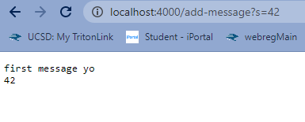
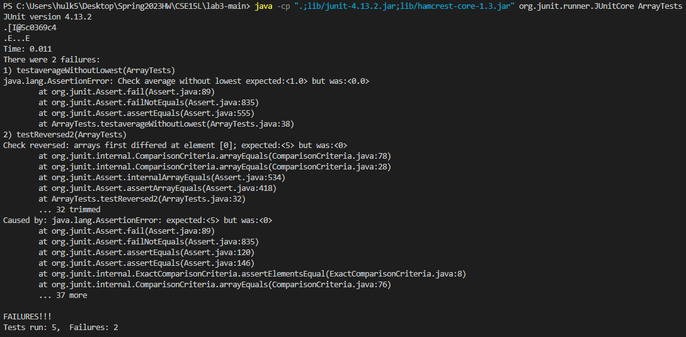

# Lab 2  
## Part 1  
  
This code allows you to create a server on your computer.  
Specifically, the server is started by calling `Server.start(port, new Handler())`  
  
After entering the URL in the terminal on the browser, I changed the path and query from `/` to `/add-message?s=first message yo`  
, which calls the "handleRequest" method. The method takes an URI object as argument.  
HandleRequest first gets the path of the URL using `url.getPath()`. If the path is changed to `/add-message`, the parameters of the 
query would be retrieved and saved into the variable "parameters," by calling `String[] parameters = url.getQuery().split("=")`
The first parameter of the query is then checked to see if it is equal of "s". If so, the string after the equal sign would be saved in
the arraylist "message". After that, the content in "message" would be changed into a string called "out" by calling `String out = String.join("\r\n", message)`.
The string "out" is then displayed on the browser.  
  
In this image, the same path `/add-message` is used, but the query parameters are changed from `s=first message yo` to `s=42`. As a result, the string
"42" is stored into "message" and displayed on the browser along with the previous message "first message yo".  

## Part 2  
##### The "reversed" method (with bug):  
```java
static int[] reversed(int[] arr) {
  int[] newArray = new int[arr.length];
  for(int i = 0; i < arr.length; i += 1) {
    arr[i] = newArray[arr.length - i - 1];
  }
  return arr;
}
 ```  
##### Input that does not induce error:  
```java
@Test
public void testReversed() {
  int[] input1 = { };
  assertArrayEquals(new int[]{ }, ArrayExamples.reversed(input1));
}
```  
##### Failure-inducing input:  
```java
@Test
public void testReversed2() {
  int[] input = {1, 2, 3, 4, 5};
  int[] expected = new int[]{5, 4, 3, 2, 1};
  assertArrayEquals("Check reversed", expected, ArrayExamples.reversed(input));
}
```  
  
As shown on the image, the test "testReversed2" produced an error due to a bug.  
##### The "reversed" method (after bug fix):  
```java
static int[] reversed(int[] arr) {
  int[] newArray = new int[arr.length];
  for(int i = 0; i < arr.length; i += 1) {
    newArray[i] = arr[arr.length - i - 1];
  }
  return newArray;
}
```  
In the old code, the loop was replacing the elements in the input array with the elements in the new empty array. This caused the input array 
to become an empty array. In the fixed code, `arr[i] = newArray[arr.length - i - 1];` is changed to `newArray[i] = arr[arr.length - i - 1];`, so 
the new empty array would be filled with the elements of the input array in reverse order as intended. Also, `return arr;` is changed to `return newArray;`, 
so the new array of reversed elements would be returned instead of the original array.  

## Part 3  
In lab 2, I learned how to start a server in java as well as how to parse what each part of a URL represents. For example, I now understand that "/" represents a
path, and "?" represents the start of a query.
