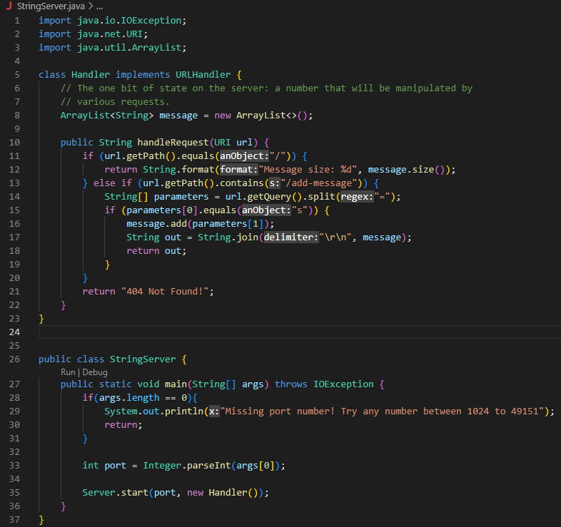
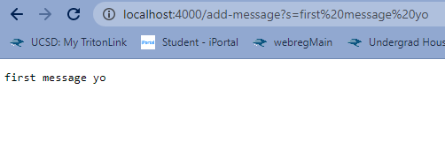

# Lab 2  
## Part 1  
  
This code allows you to create a server on your computer.  
Specifically, the server is started by calling `Server.start(port, new Handler())`
  
After entering the URL in the terminal on the browser, I changed the path and query from `/` to `/add-message?s=first message yo`  
, which calls the "handleRequest" method. The method takes an URI object as argument.  
HandleRequest first gets the path of the URL using `url.getPath()`. If the path is changed to `/add-message`, the parameters of the 
query would be retrieved and saved into the variable "parameters," by calling `String[] parameters = url.getQuery().split("=")`
The first parameter of the query is then checked to see if it is equal of "s". If so, the string after the equal sign would be saved in
the arraylist "message". After that, the content in "message" would be changed into a string called "out" by calling `String out = String.join("\r\n", message)`.
The string "out" is then displayed on the browser.  

In this image, the same path `/add-message` is used, but the query parameters are changed from `s=first message yo` to `s=42`. As a result, the string
"42" is stored into "message" and displayed on the browser along with the previous message "first message yo".  

## Part 2
