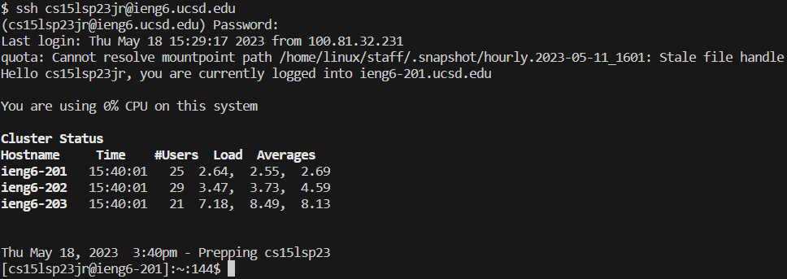
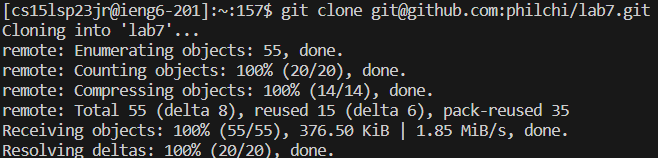
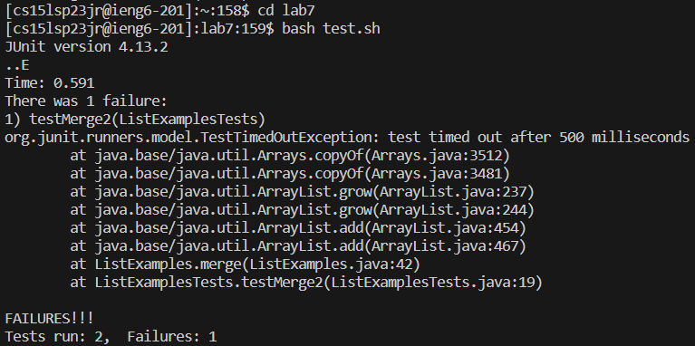
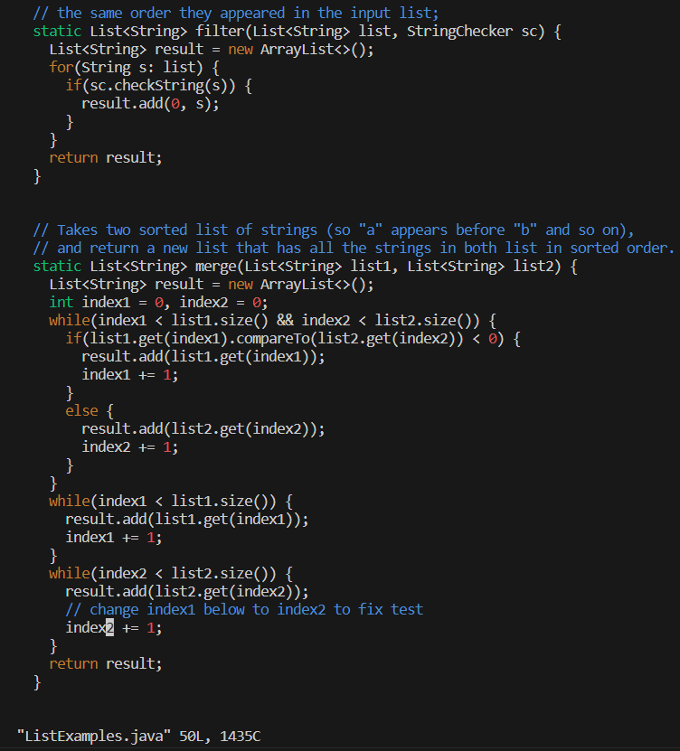
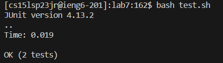
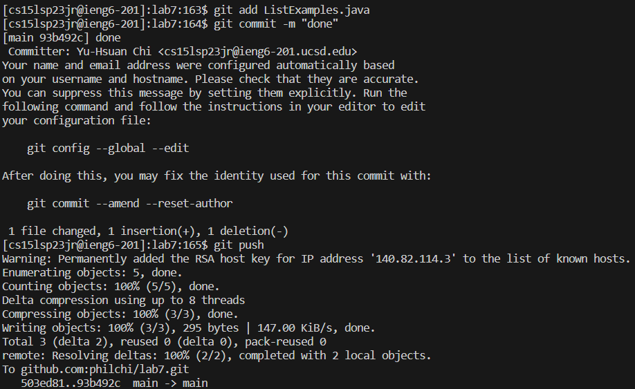

# Lab 4  
## Step 4  
  
**Key pressed:**  
`ssh cs15lsp23jr@ieng6.ucsd.edu<enter>`  
`<password><enter>`    
**Description:**  
The first command specifies the account to log into and starts the login process.  
The second command includes the password to the account and completes the login process.  
  
## Step 5  
  
**Key pressed:**  
`git clone git@github.com:philchi/lab7.git<enter>`  
**Description:**  
The command clones the repo from my fork.  
  
## Step 6  
  
**Key pressed:**  
`cd lab7<enter>`  
`bash test.sh<enter>`  
**Description:**  
The first command switches my working direction to the local copy of the repo.  
The second command runs the bash script that includes the commands that run the test.  
The test failed.  
  
## Step 7  
  
**Key pressed:**  
`vim ListExamples.java<enter>`  
`/x1 +<enter>nna2<delete><esc>:wq<enter>`  
**Description:**  
The first command opens the file "ListExamples.java" with Vim.  
The second line navigates to the location with an issue, fixes it, then save quits.  
`/x1 +<enter>` searches the document for the term "x1 +" and `nn` navigates the cursor to the next two matching terms.  
`a2<delete><esc>` changes the "1" in "index1" to "2".  
`:wq` quits vim.  
  
## Step 8  
  
**Key pressed:**  
`bash test.sh<enter>`  
**Description:**  
The command runs the bash script that includes the commands that run the test.  
The test passed successfully.  
  
## Step 9  
  
**Key pressed:**  
`git add ListExamples.java<enter>`  
`git commit -m "done"<enter>`  
`git push<enter>`  
**Description:**  
The first command adds the file "ListExamples.java" to the staging area.  
The second command commits the changes added to the staging area, while including the comment "done".  
The third command pushes the commit to the remote repo, which is my fork on github.  
