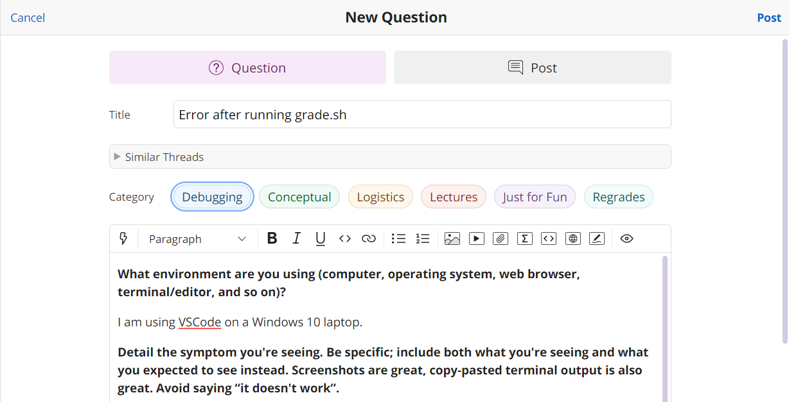
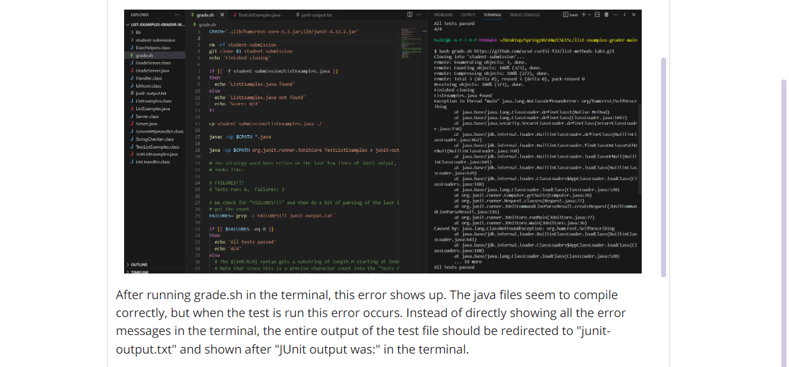
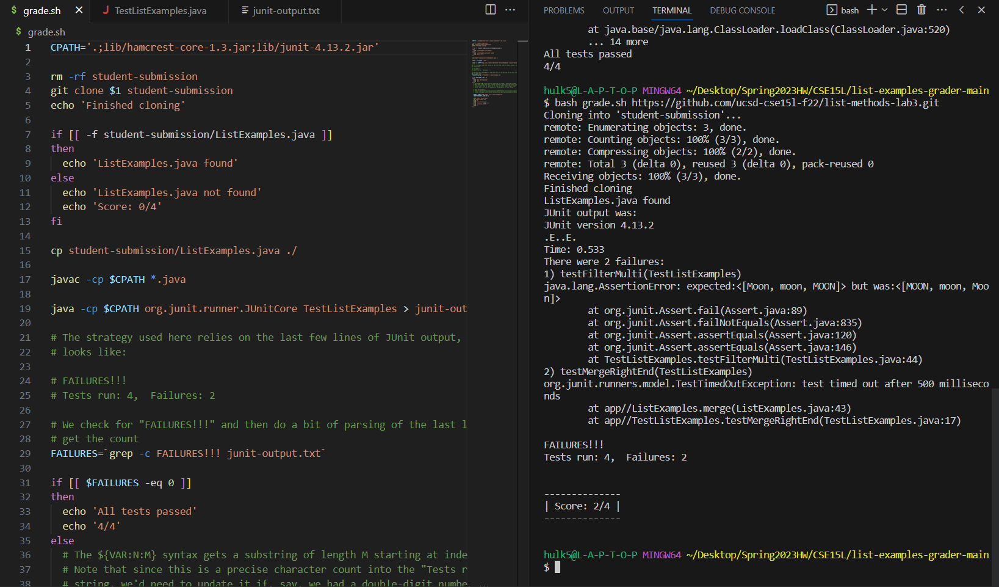
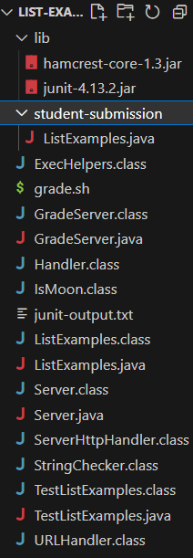
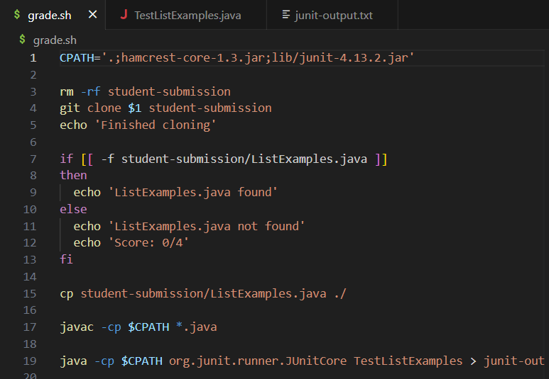
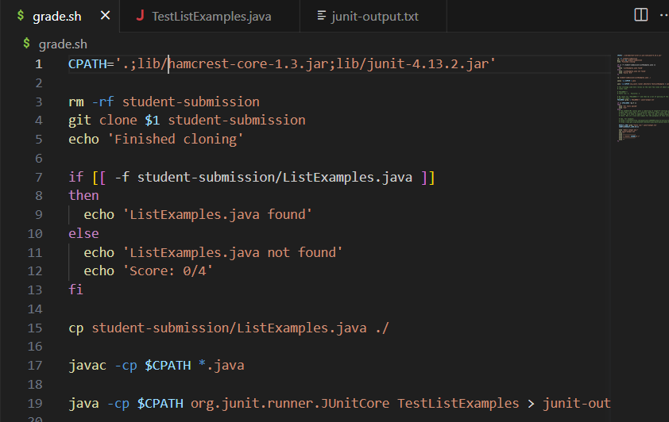

# Lab 5  
## Debugging Scenario  
### Student's question regarding the symptom  
  
  
  
  
### TA response  
Just like what you described in the post, the issue seems to happen after the line that redirects the output of the test file to junit-output.txt. Try to double 
check your "CPATH" to see if it contains the correct classpath for both junit jar files.  
  
### Student's response  
I double checked my CPATH and found that I have missed the `lib/` before `hamcrest-core-1.3.jar;` in CPATH.  
Instead of `CPATH='.;hamcrest-core-1.3.jar;lib/junit-4.13.2.jar'`, it should have been `CPATH='.;lib/hamcrest-core-1.3.jar;lib/junit-4.13.2.jar'`.  
  

### Summary  
The following are the files in the working directory after running the script.  
  
The working directory is `/c/Users/hulk5/Desktop/Spring2023HW/CSE15L/list-examples-grader-main`  
Code before the fix:  
  
Code after the fix (first line changed):  
  
The command line that triggered the bug: `bash grade.sh https://github.com/ucsd-cse15l-f22/list-methods-lab3.git`  
  
## Reflection  
I have never used Vim before. I have only heard from people that Vim is notoriously difficult to use prior to learning it in the course. The Vim tutorial in we did 
in lab was very helpful in getting us started on the basics of Vim. Now that I know how to use Vim, I will be able to use linux systems more freely. I also learned 
how to write a bash script that actually functions. This skill would be useful in the future if I have projects that involve automation.
