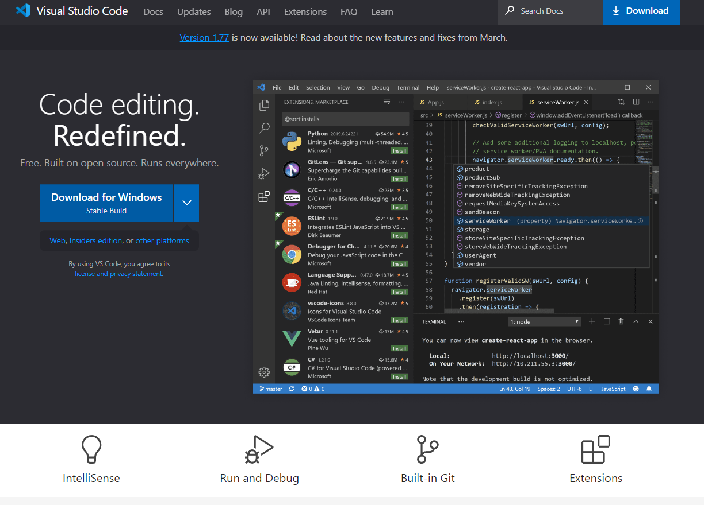
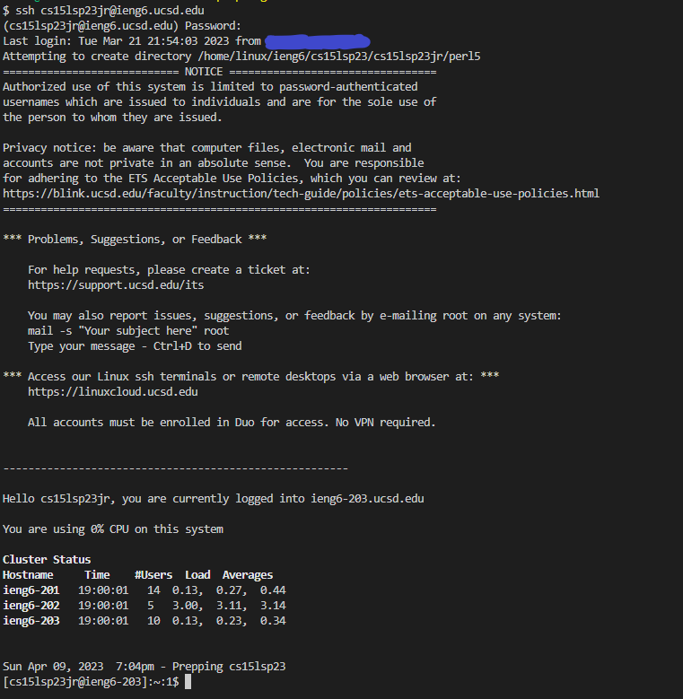
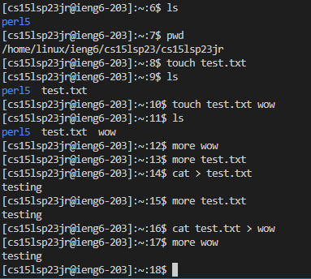

## VScode
VScode is a great IDE that supports a plethora of extensions that are useful to users coding in any language.  
To install Visual Studio Code, go to the following website, then click on the download button on the page.
[VScode](https://code.visualstudio.com/)  
  

After downloading the installer, simply open the file and follow the instructions until VScode is installed.

## Remote Access
To remotely access a computer using a course-specific account, first get your account ID with the account lookup tool from
the following website: [lookup tool](https://sdacs.ucsd.edu/~icc/index.php)  
Attach the account ID with @ieng6.ucsd.edu to make your login account for remote access.

The command for remote access is simply ssh followed by space and your account.  
For example  
  
After entering the command, you would be prompted to enter the account password.
Once you have entered the password, the remote access is successfully established.

## What now?
After being able to remotely access a computer for the purpose of school work, you can try out a variety of commands 
to get yourself familiar with the working environment.  
For example  
  
